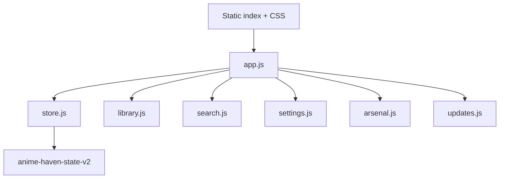

# KageNexus 2.0 Core Rebuild

## Safety boundary

- Baseline: Release 62, commit `be161ba2b131b9d0e7c17a96b56ab085f60511e8` on `main`.
- Rebuild branch: `agent/kagenexus-2-core-rebuild`.
- `main` and the live GitHub Pages release remain unchanged until the beta passes device and migration checks.

## Release 62 architecture captured

The old startup downloaded three Base64 parts, rebuilt a ZIP, decompressed five files, rewrote source text, and executed three files with `eval`.

| Package file | Uncompressed bytes |
|---|---:|
| `index.html` | 7,560 |
| `styles.css` | 21,033 |
| `data.js` | 67,548 |
| `config.js` | 164 |
| `app-v2.js` | 31,330 |

The ZIP SHA-256 is `02bd73b54887848edbc1d7a6ad82feaa2915191a35cc83490a0527b83bbce57f`.

The mobile layer separately joined nine Base64 parts into a JSON payload containing 27,679 JavaScript characters and 12,842 CSS characters. It then applied seven exact-source patches before calling `eval`. Its decoded SHA-256 is `f737553a2cd9ff2b2870f60042f1d1341581f5e6408f59b3506261136b4435b1`.

`scripts/extract-release-62.mjs` records and verifies that baseline. Runtime code no longer downloads or executes either package.

## New runtime

- No active `eval` or `new Function`.
- No runtime ZIP, Base64 package joining, or exact-line patching.
- Static CSS files replace core runtime-injected styles.
- Library seed data and Arsenal data are importable, testable modules.
- Arsenal still contains 1,778 entries: 1,766 weapons and 12 powers.
- Arsenal still renders 96 cards initially and adds more incrementally.
- The service worker uses a new beta cache and update lifecycle.

## Save compatibility contract

- Primary key remains exactly `anime-haven-state-v2`.
- State schema remains version `2`.
- Ashton remains the active profile and existing item fields are preserved, including unknown future fields.
- Existing library migration v15 is applied in `store.js` before feature modules load, eliminating the previous migration reload.
- Release 62’s duplicate ID for “How Not to Summon a Demon Lord” and “How Not to Summon a Demon Lord Ω” is repaired deterministically; Ω becomes `seed-how-not-to-summon-a-demon-lord-omega` without losing its progress.
- Raw legacy backup JSON, KageNexus backup envelopes, files, and `KNX1.` sync codes remain accepted.
- Imports retain the newest `updatedAt` value title by title and keep a pre-import safety copy.
- Existing preferences remain under their original keys, including performance mode, search style, Arsenal favorites, and Arsenal recents.

## Automated coverage

`npm run check` verifies:

- Home counts and the complete library
- Archive and Unstarted routing/filtering
- Settings, performance choices, and Data & Sync controls
- saved and AniList search behavior
- Up Next ordering and three-card limit
- episode progress and persisted state schema
- backup merge, import safety copy, and Unicode sync-code round trips
- library seed and unique-ID contracts
- all 1,778 Arsenal entries, type totals, unique IDs, and 96-card initial rendering
- full feature-module installation
- no active eval, encoded package fetches, runtime source patching, or core style injection

`npm run visual:smoke` launches a real Chromium build and verifies:

- settled desktop renders for Home, Archive, Unstarted, Settings, and Arsenal
- separate mobile Home and Arsenal renders at 390 × 844
- no console errors, uncaught page errors, or failed same-origin requests
- no mobile horizontal overflow
- no eager Arsenal cards during Home startup and exactly 96 cards on Arsenal's first page
- an offline reload through `sw-core.js`

## Merge gate

Before this branch replaces the live release:

1. Run the full suite from a clean checkout.
2. Verify the beta on iPhone Safari/PWA and desktop.
3. Test an actual Release 62 localStorage export through the migration.
4. Verify offline launch and the update prompt over HTTPS.
5. Exercise AniList search and representative image, GIF, and 3D Arsenal media.
6. Compare Home, Archive, Unstarted, Search, Settings, and Arsenal visually with Release 62.
7. Remove the retained legacy package artifacts only after the comparison is complete.
